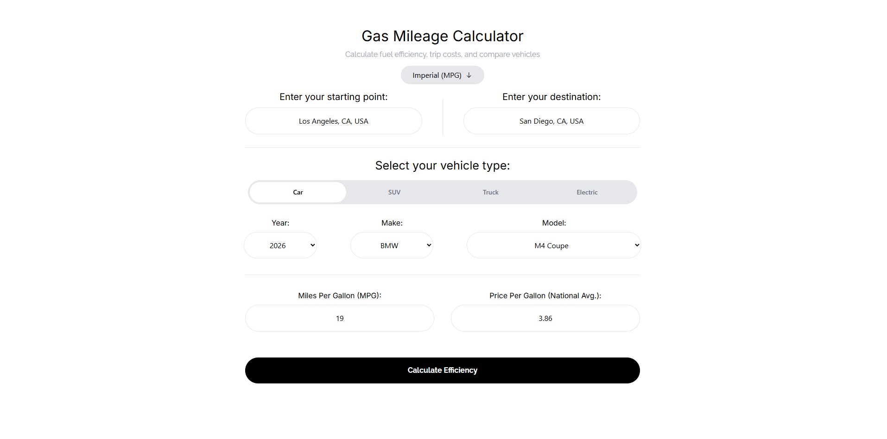
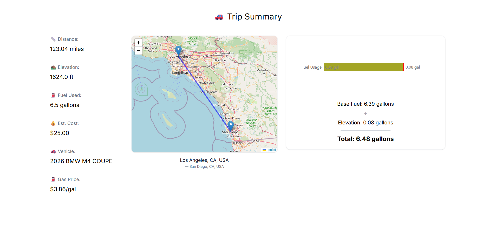

# ⛽ Gas Mileage Calculator

A React application that calculates real fuel costs and efficiency for any road trip using live API data. Enter your origin, destination, and vehicle — the app fetches real driving distance, elevation, live fuel prices, and your vehicle's MPG to give you an accurate trip cost estimate.

## 🔗 Live Demo
[gas-mileage-calculator-eight.vercel.app](https://gas-mileage-calculator-eight.vercel.app/)

## 📸 Screenshots

### Input Screen


### Results Screen


## 🚀 Features
- Real driving distance and elevation via OpenRouteService API
- Vehicle MPG auto-fill via FuelEconomy.gov API
- Live national fuel prices via DOE API
- Electric vehicle support with kWh calculations
- Address autocomplete for origin and destination
- Vehicle year/make/model dropdown powered by FuelEconomy.gov
- Interactive route map via React Leaflet
- Fuel breakdown chart via Recharts
- Imperial/Metric toggle (MPG ↔ L/100km)
- Two-page scroll layout locked until calculation is triggered

## 🛠 Tech Stack
- React + Vite (JavaScript)
- Tailwind CSS
- Recharts
- React Leaflet
- FuelEconomy.gov API
- OpenRouteService API
- DOE Fuel Prices API

## 🔧 How It Works
1. User enters an origin and destination — addresses are geocoded via OpenRouteService
2. User selects their vehicle year, make, and model — MPG is auto-fetched from FuelEconomy.gov
3. Live national fuel prices are pulled from the DOE API based on fuel type
4. On Calculate, real driving distance and elevation gain are fetched from OpenRouteService
5. Fuel used and trip cost are calculated and displayed alongside an interactive map and fuel breakdown chart

## ⚙️ Setup
1. Clone the repo
2. Run `npm install --legacy-peer-deps`
3. Create a `.env` file in the root and add:
```
VITE_ORS_API_KEY=your_openrouteservice_key
```

4. Run `npm run dev`

## 👤 Author
Anthony C — [GitHub](https://github.com/anthonys-hub)